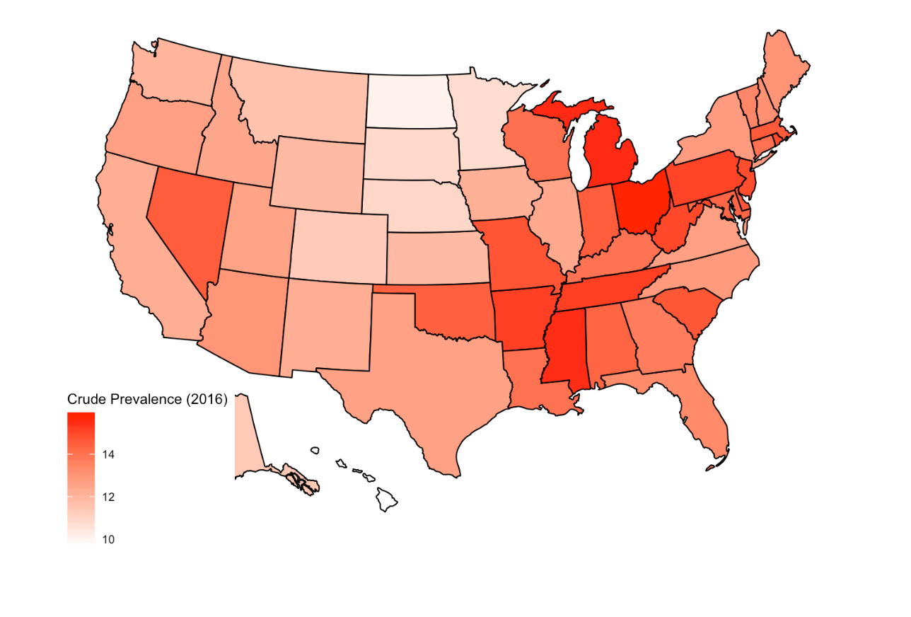

*Yuning Wang (yw3438); Aiming Liu (al3998); Qi Lu (ql2370); Yucong Jiang (yj2581); WeiRan Zhang (wz2506)*
*12/02/2019*

***

## Motivation

### Basic Knowlegde about Mental Health

 - Mental health is an important component of overall health.
 - Can increases the risk for many types of physical health problems.
 - Presence of chronic physical health problems can also increase the risk for mental health problems.
 - Over 45 million Americans - almost 20% - are experiencing a mental illness. 57% of adults with a mental illness receive no treatment.
 
*Here's the map of bad mental health prevalence*

 
*The prevalence of mental illness among U.S. adults(2017)*

 
### Goals of project

 - Understanding the risk factors for bad mental health
 
 - Visualizing correlation of the risk factors and bad mental health
 
 - visualizing the distribution of risk factors and bad mental health prevalence across United States.
 
 - Giving suggestions about reducing prevelance of bad mental health

***

## Questions

We tried to figure out the possible causes of bad mental health or mental health illness. We were also interested in visualizing the distribution of risk factors and mental illness prevalence prevalence in the United states, by state and by cities. In addition, we also sought to figure out the correlations between bad mental health and chronic disease and bad living behaviors. As a result, the questions were as followed:

  - What are the risk factors of bad mental health? What are the correlations between the outcome and the factors? How to visualize them?
  
  - What are the distributions of bad mental health and risk factors in different states and cities in the United States? How to visualize them?
  
  - Are there any ways for us to reduce the prevalence of bad mental health?
  
***

## Data

In order to do the analysis, we utilized the [500 Cities: Local Data for Better Health, 2018 release](https://chronicdata.cdc.gov/500-Cities/500-Cities-Local-Data-for-Better-Health-2018-relea/6vp6-wxuq/data) dataset. This dataset includes 2016, 2015 model-based small area estimates for 27 measures of chronic disease related to unhealthy behaviors (5), health outcomes (13), and use of preventive services (9). Data were provided by the Centers for Disease Control and Prevention (CDC), Division of Population Health, Epidemiology and Surveillance Branch. The project was funded by the Robert Wood Johnson Foundation (RWJF) in conjunction with the CDC Foundation. Other datas about [U.S. states and territories' income](https://en.wikipedia.org/wiki/List_of_U.S._states_and_territories_by_income), [U.S. states and territories' educational attainment](https://en.wikipedia.org/wiki/List_of_U.S._states_and_territories_by_educational_attainment) and [U.S. population race](https://www.census.gov/newsroom/facts-for-features/2016/cb16-ff01.html) were also used in analyzing the cause of mental health problems.

We downloaded the datasets and filtered the variables that we were interested in and established a new dataset. The risk factors that we are interested in include:

 - **CANCER**: Cancer (excluding skin cancer) among adults aged >= 18 Years
 - **DIABETES**: Diagnosed diabetes among adults aged >=18 Years
 - **DRINKING**: Binge drinking among adults aged >=18 Year
 - **OBESITY**: Obesity among adults aged >=18 Years
 - **SLEEPING**: Sleeping less than 7 hours among adults aged >=18 Years
 - **INCOME**: Median household income in U.S. states and territories
 - **EDUCATION**: Education attainment in U.S. states and territories
 - **RACE**: Population Race in U.S. states and territories
 
Outcome that we were interested in is:
 
 - **MENTAL HEALTH**: Mental health not good for >=14 days among adults aged >=18 Years

